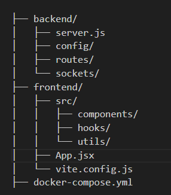

# 💬 Realtime Chat App con React + Node + Socket.IO

Este es un proyecto de demo para un chat en tiempo real utilizando **React** en el frontend y **Express + Socket.IO** en el backend, con estructura modular y código reutilizable.

---

## 🧰 Tech Stack

- **Frontend:** React (Vite)
- **Backend:** Node.js + Express + Socket.IO
- **Comunicación:** Websockets (Socket.IO)
- **Docker:** Opcional, para facilitar el entorno

---

## 🚀 Cómo ejecutar el proyecto

### 🔧 1. Ejecutar SIN Docker

---

#### 🖥 Backend (Puerto `3000`)

```bash
cd backend
npm install
node run start
```

El servidor quedará corriendo en: http://localhost:3000

#### 🌐 Frontend (Puerto `5173`)

```bash
cd chat-frontend
npm install
npm run dev
```

El cliente quedará corriendo en: http://localhost:5173

Asegúrate de que el frontend se conecta al backend en http://localhost:3000. Esto ya está preconfigurado en el hook useSocket.js

### 🐳 2. Ejecutar CON Docker

#### ✅ Pre-requisitos
- Docker y Docker Compose instalados

#### ▶️ Levantar los servicios
Desde la raíz del proyecto (donde se encuentra el archivo docker-compose.yml) hay que ejecutar el siguiente comando:
```bash
docker-compose up -d
```

Eso arrancará:
- Backend en: http://localhost:3000
- Frontend en: http://localhost:5173

## 🗂️ Estructura del proyecto
La estructura del proyecto es la siguiente:

