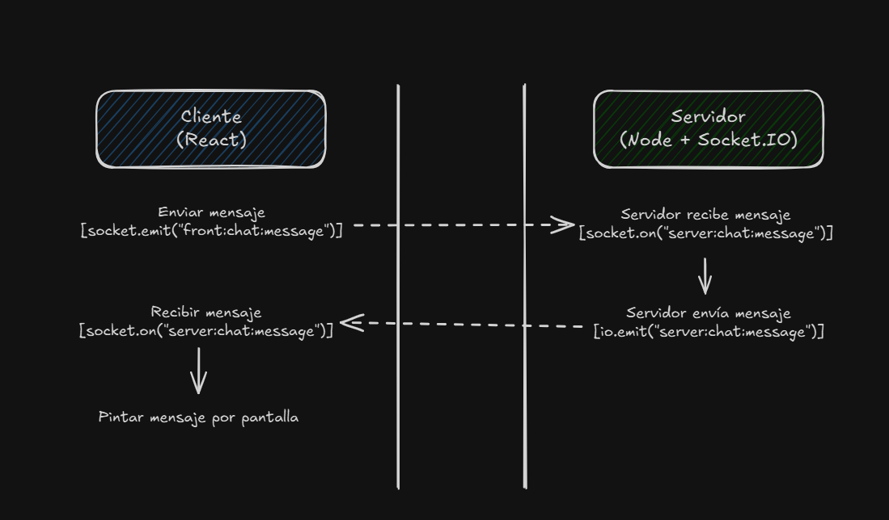

# 💬 Realtime Chat App con React + Node + Socket.IO

Este es un proyecto de demo para un chat en tiempo real utilizando **React** en el frontend y **Express + Socket.IO** en el backend, con estructura modular y código reutilizable.

---

## 🧰 Tech Stack

- **Frontend:** React (Vite)
- **Backend:** Node.js + Express + Socket.IO
- **Comunicación:** Websockets (Socket.IO)
- **Docker:** Opcional, para facilitar el entorno

---

## 🚀 Cómo ejecutar el proyecto

### 🔧 1. Ejecutar SIN Docker

---

#### 🖥 Backend (Puerto `3000`)

```bash
cd backend
npm install
npm run start
```

El servidor quedará corriendo en: http://localhost:3000

#### ⚛️ Frontend (Puerto `5173`)

```bash
cd chat-frontend
npm install
npm run dev
```

El cliente quedará corriendo en: http://localhost:5173

Asegúrate de que el frontend se conecta al backend en http://localhost:3000. Esto ya está preconfigurado en el hook useSocket.js

### 🐳 2. Ejecutar CON Docker

#### ✅ Pre-requisitos
- Docker y Docker Compose instalados

#### ▶️ Levantar los servicios
Desde la raíz del proyecto (donde se encuentra el archivo docker-compose.yml) hay que ejecutar el siguiente comando:
```bash
docker-compose up -d
```

Eso arrancará:
- Backend en: http://localhost:3000
- Frontend en: http://localhost:5173

## 🗂️ Estructura del proyecto
La estructura del proyecto es la siguiente:


## 🌐 Funcionamiento de los Sockets


### 🛠️ Diferentes funciones de socket

| Función                    | ¿A quién se le envía?                                     |
|---------------------------|------------------------------------------------------------|
| `socket.emit`             | Solo al cliente o servidor que está conectado por ese socket |
| `socket.on`               | Escucha los eventos que le llegan al socket                |
| `io.emit`                 | A **todos los sockets conectados**                        |
| `socket.broadcast.emit`   | A **todos excepto el socket que emite**                   |
| `socket.join` / `leave`   | Añadir o quitar sockets de "salas" específicas             |
| `socket.disconnect`       | Desconectar el socket                                     |
| `socket.id`               | ID único para ese socket                                  |

